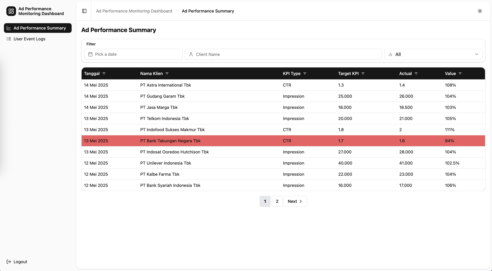

# Ad Performance Monitoring Dashboard



[Live Demo](https://argadeva.github.io/ads-performance-dashboard/)

## Description
The Ad Performance Monitoring Dashboard is a web-based analytics tool designed to provide a comprehensive summary of advertising performance across multiple clients. The dashboard enables users to track key performance indicators (KPIs) such as CTR (Click-Through Rate) and Impressions, helping marketing teams monitor campaign effectiveness in real time.

## Features
- Dashboard Overview
- Data Filtering & Sorting
- Interactive Data Table
- Mock API Integration
- Dark/Light Theme Toggle≈
- User Event Logging
- Responsive Design
- Unit Testing & Coverage

## Tech Stack
- React 18.2.0
- TypeScript
- Vite
- React Router DOM
- Radix UI + Tailwind CSS
- Lucide React
- MirageJS
- Vitest + Testing Library
- ESLint + Prettier

## Installation

1. Clone the repository:
  ```sh
  git clone https://github.com/your-username/github-repositories-explorer.git
  ```
2. Navigate to the project directory:
  ```sh
  cd github-repositories-explorer
  ```
3. Install dependencies:
  ```sh
  npm install
  ```

## Usage

1. Start the development server:
  ```sh
  npm run dev
  ```
2. Open your browser and navigate to `http://localhost:3000`

## Project Structure
```
ads-performance-dashboard/
├── public/
│   ├── screenshot.png
│   └── unit_tests.png
├── src/
│   ├── components/
│   │   ├── AppSidebar.tsx
│   │   └── ui/
│   │       ├── Breadcrumb.tsx
│   │       ├── Button.tsx
│   │       └── (..etc..)
│   ├── context/
│   │   ├── SidebarContext.tsx
│   │   ├── ThemeContext.tsx
│   │   ├── UserEventContext.tsx
│   │   ├── useSidebar.ts
│   │   ├── useTheme.ts
│   │   └── useUserEvent.ts
│   ├── hooks/
│   │   └── useMobile.ts
│   ├── lib/
│   │   └── utils.ts
│   ├── mirage/
│   │   ├── __tests__/
│   │   │   └── server.test.ts
│   │   ├── factories.ts
│   │   ├── handlers.ts
│   │   ├── models.ts
│   │   ├── routes.ts
│   │   └── server.ts
│   ├── pages/
│   │   ├── PerformanceSummary.tsx
│   │   └── UserEventLogs.tsx
│   ├── App.tsx
│   ├── Layout.tsx
│   └── main.tsx
├── coverage/
│   └── ... (coverage reports)
├── .eslintrc
├── .prettierrc
├── components.json
├── package.json
├── README.md
└── vite.config.ts
```

**Description:**  
This project structure follows a modular and scalable approach for a React + TypeScript dashboard application.  
- The `public/` folder contains static assets such as screenshots and test coverage images.
- The `src/components/` directory holds reusable UI components, with a dedicated `ui/` subfolder for atomic UI elements.
- The `src/context/` folder manages React context providers and related hooks for global state management (e.g., sidebar, theme, user events).
- The `src/hooks/` directory contains custom React hooks.
- The `src/lib/` folder is for utility functions.
- The `src/mirage/` directory is used for API mocking with MirageJS, including factories, handlers, models, routes, and tests.
- The `src/pages/` folder contains page-level components for different dashboard views.
- The root of `src/` includes the main application entry points (`App.tsx`, `Layout.tsx`, `main.tsx`).
- The `coverage/` directory stores test coverage reports.

## Test Coverage

The project maintains high test coverage to ensure code quality and reliability. Below is the latest coverage report:


You can find detailed coverage reports in the `coverage` directory after running:
```sh
npm run test:coverage
```

## Available Scripts
```sh
npm run dev - Start development server
npm run build - Build for production
npm run preview - Preview production build
npm run test - Run tests
npm run test:coverage - Run tests with coverage
npm run lint - Run ESLint
npm run lint:fix - Fix ESLint issues
npm run format - Check code formatting
npm run format:fix - Format code with Prettier
```